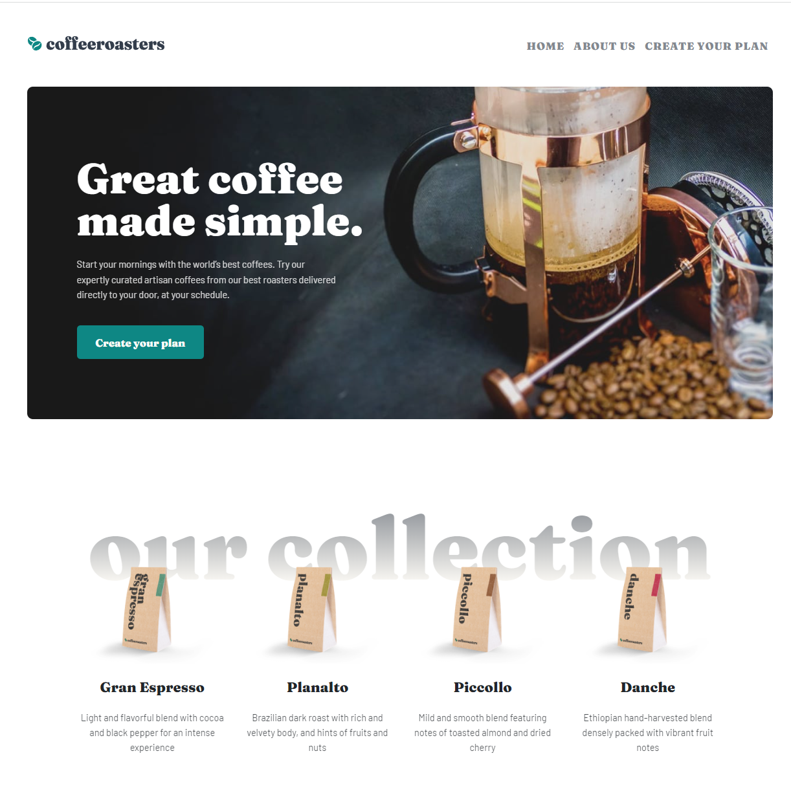

# Coffeeroasters subscription site (Frontend Mentor challenge)

This is my solution to the [Coffeeroasters subscription site challenge on Frontend Mentor](https://www.frontendmentor.io/challenges/coffeeroasters-subscription-site-5Fc26HVY6).

## Table of contents

- [Overview](#overview)
  - [The challenge](#the-challenge)
  - [Screenshot](#screenshot)
  - [Links](#links)
- [My process](#my-process)
  - [Built with](#built-with)
  - [Useful resources](#useful-resources)
- [Author](#author)

## Overview

### The challenge

Users should be able to:

- View the optimal layout for each page depending on their device's screen size
- See hover states for all interactive elements throughout the site
- Make selections to create a coffee subscription and see an order summary modal of their choices

### Screenshot

### Links

- Solution URL: [https://github.com/dominikapap/Coffeeroasters-FM](https://github.com/dominikapap/Coffeeroasters-FM)
- Live Site URL: [https://dominikapap-coffeeroasters.netlify.app](https://dominikapap-coffeeroasters.netlify.app)

## My process

### Built with

- Semantic HTML5 markup
- SCSS/CSS custom properties
- BEM metodology
- Boostrap 5 (customized)
- Flexbox
- Mobile-first workflow
- RWD
- JavaScript ES6+

### Useful resources

- [Responsive Typography](https://www.youtube.com/watch?v=VQraviuwbzU) - This helped optimize headers font sizes across different devices. I really liked this pattern and will use it going forward.

- [How to Fix Issues With CSS Position Sticky Not Working?](https://www.designcise.com/web/tutorial/how-to-fix-issues-with-css-position-sticky-not-working) - This helped me made css position:sticky work in flexbox.

## Author
- Linkedin - [My LinkedIn profile](https://www.linkedin.com/in/dominika-papierska-1ba09311a/)
- Email - domi.papierska@gmail.com

